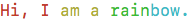

# golang-rainbow

This is a simple golang package that can be used to turn your terminal output into a rainbow. It was inspired by the Ruby gem [Lolize](https://github.com/miaout17/lolize).

This package is meant for fun only.

## Get it!
### OSX

Assuming you are set up for golang, simply run from the terminal:

`go get github.com/guineveresaenger/golang-rainbow`

## Use it!
The package contains a single function, `Rainbow`. It takes a string input and an integer count. It returns nothing, printing a rainbowized version of your string, followed by a newline, to the terminal.

_String input_
Whatever string you want rainbowized!

_Counter_
If you print multiple lines, a running line count passed to `Rainbow` will offset the colors in your rstring, making a diagonal rainbow. For a vertical rainbow, set this value to zero.

### Example

`rainbow.Rainbow("Hi, I am a rainbow.", 0)` 